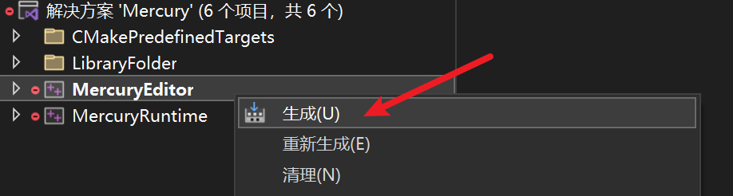
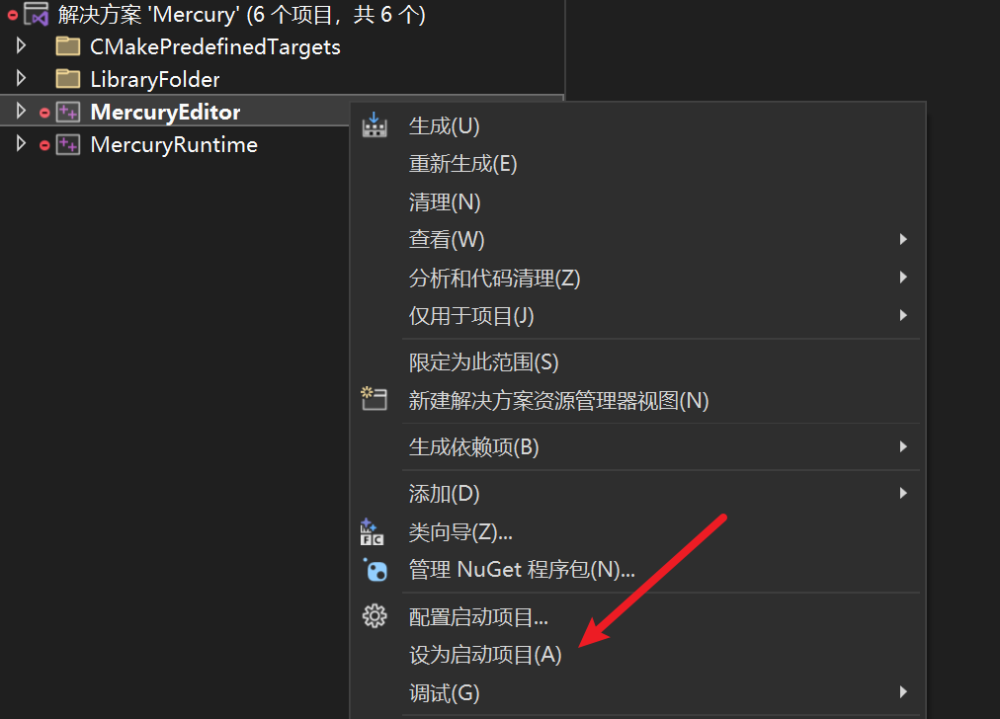
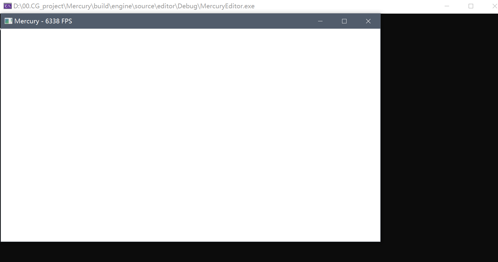

# 01 引擎框架

本篇主要介绍引擎框架的搭建。

## 版本说明
文档版本：`tag v0.02`
源码版本：`tag v0.01`，其中`engine.h`和`engine.cpp`需要对照`tag v0.02`进行修改才能看到帧率。

## 目录结构
在整个引擎源码中，最初的引擎框架可以简单分为编辑器模块（editor）和运行时（runtime）模块。在根目录下运行命令`tree /f`可以看到目录结构如下：
```bash
source
    ├─editor
    │  │  CMakeLists.txt
    │  │
    │  ├─include
    │  │      editor.h
    │  │      editor_ui.h
    │  │
    │  ├─resource
    │  │      editor.ico
    │  │      editor.rc
    │  │
    │  └─source
    │          editor.cpp
    │          editor_ui.cpp
    │          main.cpp
    │
    └─runtime
        │  CMakeLists.txt
        │  engine.cpp
        │  engine.h
        │
        └─function
            ├─global
            │      global_context.cpp
            │      global_context.h
            │ 
            ├─render
            │      window_system.cpp
            │      window_system.h
            │
            └─ui
                   window_ui.h
```

## 编译运行

### Windows
在根目录下运行`cmake -S . -B build`即可生成build文件夹，得到Virtual Studio项目。

打开后右键“MercuryEditor”，点击“生成”进行编译。


编译完毕后，右键“MercuryEditor”，点击“设为启动项目”，之后即可调试运行。


运行结果为一个白色窗口。


### MacOS
...
### Linux
...

## 模块分析

> 注意：**对于编辑器模块，仅仅是对引擎的一个界面包装，真正运行的是运行时模块。**

在`main`函数中，创建了一个引擎类`Engine`对象和编辑器`MercuryEditor`对象。

**首先初始化引擎类对象：**
- 引擎类对象的初始化中，开启运行**全局的运行时上下文** `g_runtime_global_context`
- 在`g_runtime_global_context`中运行窗口系统`WindowSystem`（此时的全局运行时上下文仅存在窗口系统）

**然后初始化编辑器类对象：**
- 通过引擎类对象来初始化，同时创建UI界面类`EditorUI`对象
- 在UI界面类`EditorUI`对象中，通过全局运行时上下文中的`WindowSystem`对象来初始化编辑器界面

**运行过程：**
- `main`函数中调用的是编辑器类对象的`run`函数
- 而实际上，在编辑器运行时，调用的是引擎类对象的帧计算函数：
  - `calculateDeltaTime`计算两帧之间的时间差
  - `tickOneFrame`在时间差中进行tick计算，并计算当前的帧率