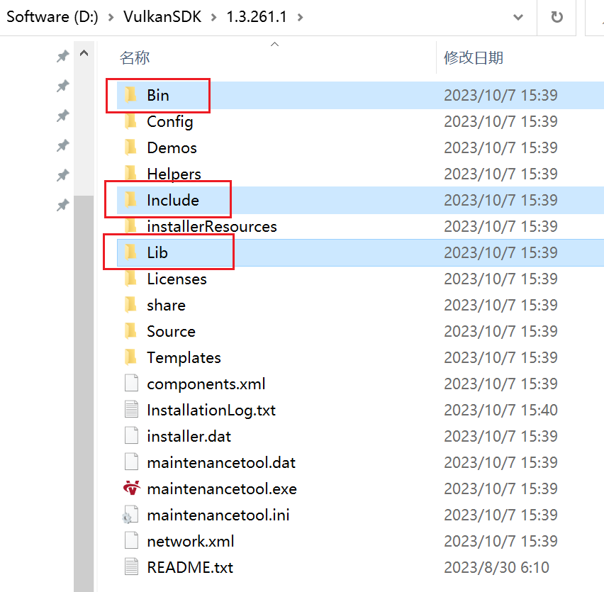

# 02 渲染系统

本篇主要介绍渲染系统的搭建，并引入Vulkan的接口，完成最初的Vulkan实例创建过程。

## 版本说明
文档版本：`tag v0.02`
源码版本：`tag v0.02`

## 目录结构
```bash
source
    ├─editor
    │  │  CMakeLists.txt
    │  │
    │  ├─include
    │  │      editor.h
    │  │      editor_ui.h
    │  │
    │  ├─resource
    │  │      editor.ico
    │  │      editor.rc
    │  │
    │  └─source
    │          editor.cpp
    │          editor_ui.cpp
    │          main.cpp
    │
    └─runtime
        │  CMakeLists.txt
        │  engine.cpp
        │  engine.h
        │
        └─function
            ├─global
            │      global_context.cpp
            │      global_context.h
            │
            ├─render
            │  │  render_system.cpp
            │  │  render_system.h
            │  │  window_system.cpp
            │  │  window_system.h
            │  │
            │  └─interface
            │      │  rhi.h
            │      │  rhi_struct.h
            │      │
            │      └─vulkan
            │              vulkan_rhi.cpp
            │              vulkan_rhi.h
            │
            └─ui
                    window_ui.h
```

## Vulkan配置

### Windows
安装SDK：https://vulkan.lunarg.com/sdk/home#windows

找到安装目录后，将其中的三个文件夹下的文件组织到同一个文件夹中放入项目的`library`文件夹下：


本项目中是VulkanSDK文件夹：
```bash
VulkanSDK
│      ├─bin
│      │  └─Win32
│      │          glslangValidator.exe // glsl验证器
│      │          VkLayer_khronos_validation.dll
│      │          VkLayer_khronos_validation.json
│      │
│      ├─include
│      │  ├─vk_video // 所依赖的头文件
│      │  │
│      │  ├─vma // 用于内存分配
│      │  │
│      │  └─vulkan // 核心头文件
│      │
│      └─lib
│          └─Win32
│                  vulkan-1.lib // 核心库文件
```

### MacOS
...

### Linux
...

### CMakeLists.txt
按照代码修改相应的cmake配置，将vulkan库引入项目。

## 模块分析

> RHI：Render Hardware Interface，外界代码调用RHI接口，不需要考虑内部实现是DirectX或者Vulkan。


在`main`函数中，创建了一个引擎类`Engine`对象和编辑器`MercuryEditor`对象。

**首先初始化引擎类对象：**
- 引擎类对象的初始化中，开启运行**全局的运行时上下文** `g_runtime_global_context`
- 在`g_runtime_global_context`中运行窗口系统`WindowSystem`和`RenderSystem`
  - 在渲染系统`RenderSystem`的初始化中，调用`VulkanRHI`的初始化。

**然后初始化编辑器类对象：**
- 通过引擎类对象来初始化，同时创建UI界面类`EditorUI`对象
- 在UI界面类`EditorUI`对象中，通过全局运行时上下文中的`WindowSystem`对象来初始化编辑器界面

**运行过程：**
- `main`函数中调用的是编辑器类对象的`run`函数
- 而实际上，在编辑器运行时，调用的是引擎类对象的帧计算函数：
  - `calculateDeltaTime`计算两帧之间的时间差
  - `tickOneFrame`在时间差中进行tick计算，并计算当前的帧率